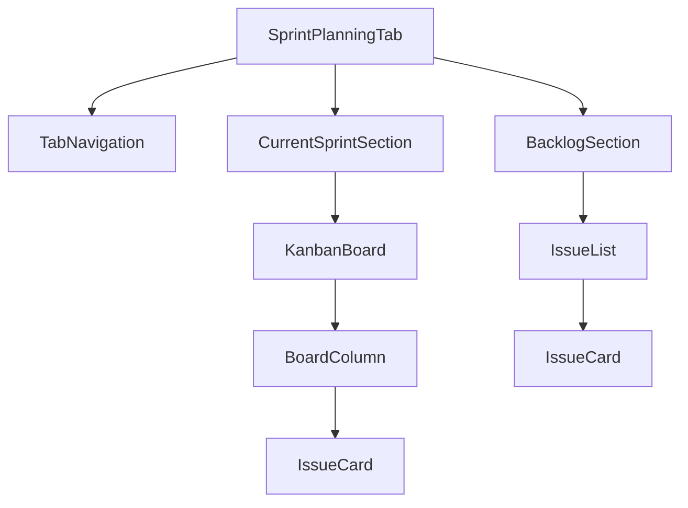
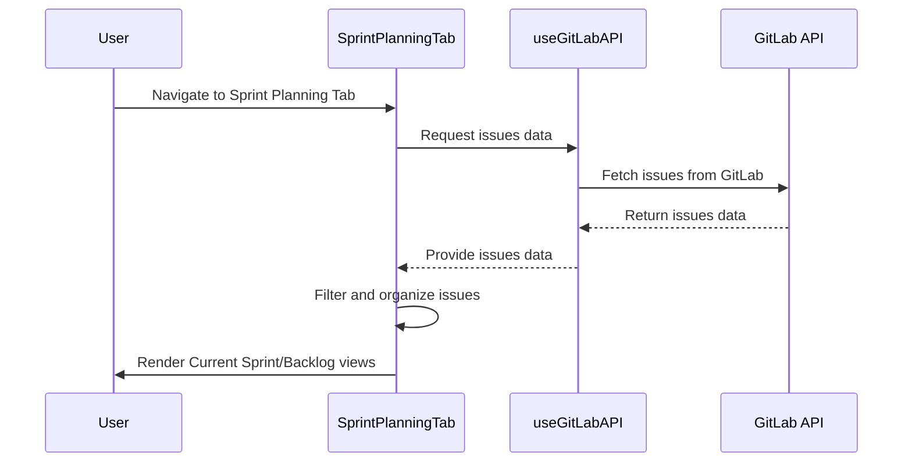

# New Tab Feature Design: Sprint Planning and Backlog Management

## Overview

This document outlines the design for implementing a new tab in the Navigator application that provides users with a clear view of their current sprint work and backlog items. The new tab will contain two sections:
1. **Current Sprint** - A Kanban board view of issues assigned to the ongoing iteration/sprint
2. **Backlog** - A list view of issues that are not assigned to any sprint and are not closed

This feature will enhance the project management capabilities of Navigator by providing dedicated views for sprint planning and backlog management.

## Architecture

### Component Structure

The new tab feature will be implemented with the following component hierarchy:



### State Management

The SprintPlanningTab component will manage the following state:

1. **Active Tab**: Tracks whether the user is viewing the "Current Sprint" or "Backlog" section
2. **Issues Data**: Cached issues data from the GitLab API
3. **Loading States**: Loading indicators for API requests
4. **Filter States**: Any applied filters for issues

### Data Flow



## Component Design

### SprintPlanningTab Component

This is the main container component that will host both the Current Sprint and Backlog sections.

```typescript
interface SprintPlanningTabProps {
  issues: GitLabIssue[];
  users: GitLabUser[];
  isLoading: boolean;
}
```

Key responsibilities:
- Manage tab navigation between Current Sprint and Backlog views
- Filter issues into appropriate sections based on sprint assignment and status
- Handle loading states and error conditions

### TabNavigation Component

An enhanced version of the existing TabNavigation component to include the new Sprint Planning tab.

```typescript
type TabType = 'issues' | 'team' | 'sprint';
```

### CurrentSprintSection Component

This component will display issues assigned to the current iteration in a Kanban board format.

Key features:
- Display issues grouped by their status (To Do, In Progress, Review, Done)
- Drag and drop functionality for moving issues between columns
- Visual indicators for issue priority and assignees
- Ability to expand issue cards for more details

### BacklogSection Component

This component will display issues that are not assigned to any sprint and are not closed.

Key features:
- List view of backlog items
- Filtering and sorting capabilities
- Ability to assign issues to sprints
- Visual indicators for issue priority and estimated effort

### KanbanBoard Component

A reusable component for displaying issues in a Kanban board format.

Props:
```typescript
interface KanbanBoardProps {
  issues: GitLabIssue[];
  onIssueMove: (issueId: number, newStatus: string) => void;
  columns: BoardColumn[];
}
```

### IssueCard Component

A reusable component for displaying individual issues in both the Kanban board and backlog list.

Props:
```typescript
interface IssueCardProps {
  issue: GitLabIssue;
  viewMode: 'kanban' | 'list';
  onDragStart?: (issueId: number) => void;
}
```

## Data Model & Filtering Logic

### Current Sprint Issues

Issues displayed in the Current Sprint section must meet the following criteria:
1. Issue has a milestone assigned (represents sprint/iteration)
2. The milestone's due date is in the future or is the current iteration
3. Issue is not in a "closed" state

Filtering logic:
```typescript
const currentSprintIssues = issues.filter(issue => 
  issue.milestone && 
  new Date(issue.milestone.due_date) >= new Date() && 
  issue.state !== 'closed'
);
```

### Backlog Issues

Issues displayed in the Backlog section must meet the following criteria:
1. Issue has no milestone assigned (not in any sprint)
2. Issue is not in a "closed" state

Filtering logic:
```typescript
const backlogIssues = issues.filter(issue => 
  !issue.milestone && 
  issue.state !== 'closed'
);
```

## UI/UX Design

### Tab Navigation

The new tab will be added to the existing tab navigation component with the label "Sprint Planning" and an appropriate icon.

### Current Sprint View

The Kanban board will have the following columns:
- To Do
- In Progress
- Review
- Done

Each column will display issue cards with:
- Issue title and ID
- Assignee avatars
- Priority indicators
- Labels
- Time estimates

### Backlog View

The backlog will display issues in a list format with:
- Issue title and ID
- Assignee information
- Priority indicators
- Labels
- Time estimates
- Creation date

## API Integration

The new tab will utilize the existing `useGitLabAPI` hook to fetch issue data. No new API endpoints need to be implemented.

### Required Data

The component will require:
- Full list of issues for the selected project/group
- User data for assignee information
- Milestone data for sprint information

## Business Logic

### Sprint Detection Logic

To determine which issues belong to the "Current Sprint":
1. Identify all milestones with due dates
2. Find the milestone with the closest future due date
3. Assign all issues with that milestone to the Current Sprint view

### Backlog Prioritization

Backlog items will be sorted by:
1. Priority labels (if present)
2. Creation date (newest first)
3. Manual prioritization (future feature)

## Testing Strategy

### Unit Tests

1. Test filtering logic for Current Sprint and Backlog sections
2. Test Kanban board column grouping
3. Test issue card rendering with various data states
4. Test tab navigation functionality

### Integration Tests

1. Test data flow from API to UI components
2. Test filtering and sorting of issues
3. Test responsive design across different screen sizes

### UI Tests

1. Test visual appearance of Kanban board
2. Test drag and drop functionality
3. Test issue card expansion and details view
4. Test responsive behavior on mobile devices

## Performance Considerations

1. Implement virtualization for large lists of issues
2. Cache filtered issue data to prevent unnecessary re-renders
3. Optimize drag and drop performance with proper event handling
4. Implement pagination for backlog items if the list becomes too large

## Future Enhancements

1. Add ability to create new sprints/milestones directly from the tab
2. Implement sprint planning features like capacity planning
3. Add burndown charts for sprint progress tracking
4. Enable assigning backlog items to sprints directly from the backlog view  issues: GitLabIssue[];
  users: GitLabUser[];
  isLoading: boolean;
}
```

Key responsibilities:
- Manage tab navigation between Current Sprint and Backlog views
- Filter issues into appropriate sections based on sprint assignment and status
- Handle loading states and error conditions

### TabNavigation Component

An enhanced version of the existing TabNavigation component to include the new Sprint Planning tab.

```typescript
type TabType = 'issues' | 'team' | 'sprint';
```

### CurrentSprintSection Component

This component will display issues assigned to the current iteration in a Kanban board format.

Key features:
- Display issues grouped by their status (To Do, In Progress, Review, Done)
- Drag and drop functionality for moving issues between columns
- Visual indicators for issue priority and assignees
- Ability to expand issue cards for more details

### BacklogSection Component

This component will display issues that are not assigned to any sprint and are not closed.

Key features:
- List view of backlog items
- Filtering and sorting capabilities
- Ability to assign issues to sprints
- Visual indicators for issue priority and estimated effort

### KanbanBoard Component

A reusable component for displaying issues in a Kanban board format.

Props:
```typescript
interface KanbanBoardProps {
  issues: GitLabIssue[];
  onIssueMove: (issueId: number, newStatus: string) => void;
  columns: BoardColumn[];
}
```

### IssueCard Component

A reusable component for displaying individual issues in both the Kanban board and backlog list.

Props:
```typescript
interface IssueCardProps {
  issue: GitLabIssue;
  viewMode: 'kanban' | 'list';
  onDragStart?: (issueId: number) => void;
}
```

## Data Model & Filtering Logic

### Current Sprint Issues

Issues displayed in the Current Sprint section must meet the following criteria:
1. Issue has a milestone assigned (represents sprint/iteration)
2. The milestone's due date is in the future or is the current iteration
3. Issue is not in a "closed" state

Filtering logic:
```typescript
const currentSprintIssues = issues.filter(issue => 
  issue.milestone && 
  new Date(issue.milestone.due_date) >= new Date() && 
  issue.state !== 'closed'
);
```

### Backlog Issues

Issues displayed in the Backlog section must meet the following criteria:
1. Issue has no milestone assigned (not in any sprint)
2. Issue is not in a "closed" state

Filtering logic:
```typescript
const backlogIssues = issues.filter(issue => 
  !issue.milestone && 
  issue.state !== 'closed'
);
```

## UI/UX Design

### Tab Navigation

The new tab will be added to the existing tab navigation component with the label "Sprint Planning" and an appropriate icon.

### Current Sprint View

The Kanban board will have the following columns:
- To Do
- In Progress
- Review
- Done

Each column will display issue cards with:
- Issue title and ID
- Assignee avatars
- Priority indicators
- Labels
- Time estimates

### Backlog View

The backlog will display issues in a list format with:
- Issue title and ID
- Assignee information
- Priority indicators
- Labels
- Time estimates
- Creation date

## API Integration

The new tab will utilize the existing `useGitLabAPI` hook to fetch issue data. No new API endpoints need to be implemented.

### Required Data

The component will require:
- Full list of issues for the selected project/group
- User data for assignee information
- Milestone data for sprint information

## Business Logic

### Sprint Detection Logic

To determine which issues belong to the "Current Sprint":
1. Identify all milestones with due dates
2. Find the milestone with the closest future due date
3. Assign all issues with that milestone to the Current Sprint view

### Backlog Prioritization

Backlog items will be sorted by:
1. Priority labels (if present)
2. Creation date (newest first)
3. Manual prioritization (future feature)

## Testing Strategy

### Unit Tests

1. Test filtering logic for Current Sprint and Backlog sections
2. Test Kanban board column grouping
3. Test issue card rendering with various data states
4. Test tab navigation functionality

### Integration Tests

1. Test data flow from API to UI components
2. Test filtering and sorting of issues
3. Test responsive design across different screen sizes

### UI Tests

1. Test visual appearance of Kanban board
2. Test drag and drop functionality
3. Test issue card expansion and details view
4. Test responsive behavior on mobile devices

## Performance Considerations

1. Implement virtualization for large lists of issues
2. Cache filtered issue data to prevent unnecessary re-renders
3. Optimize drag and drop performance with proper event handling
4. Implement pagination for backlog items if the list becomes too large

## Future Enhancements

1. Add ability to create new sprints/milestones directly from the tab
2. Implement sprint planning features like capacity planning
3. Add burndown charts for sprint progress tracking
4. Enable assigning backlog items to sprints directly from the backlog view


