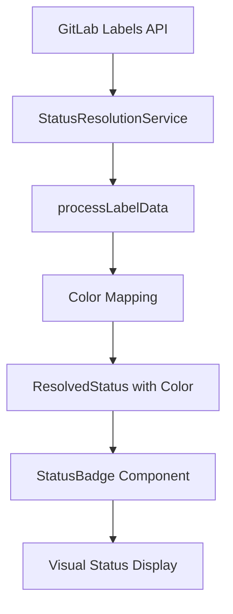
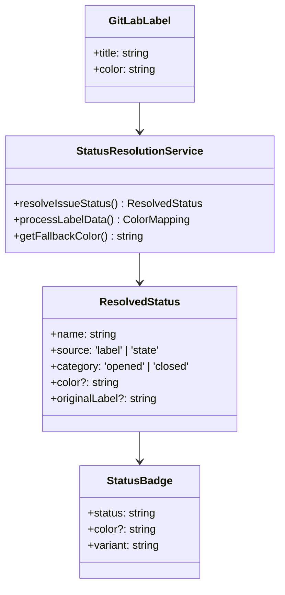
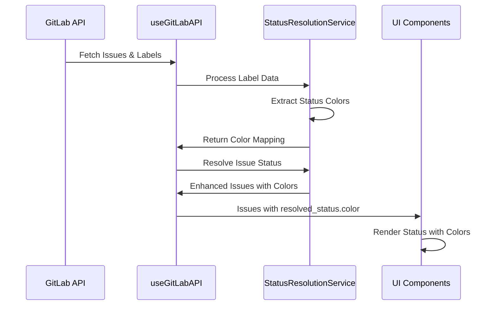

# Issue Status Coloring Enhancement

## Overview

This design document outlines the implementation of status coloring for both the **Issue Tab** and **Current Iteration Tab** in the Navigator application. The feature will enhance visual representation by displaying status colors sourced from GitLab labels with "Status::" prefix, utilizing the existing color system architecture.

## Current System Architecture

### Status Resolution System
The application currently uses a sophisticated status resolution system via `StatusResolutionService`:

- **Priority-based resolution**: Status:: labels > Issue state
- **Color extraction**: Colors retrieved from GitLab label metadata
- **Enhanced status objects**: `ResolvedStatus` interface with color information
- **Fallback mechanisms**: Default colors for common status names

### Existing Components

#### StatusBadge Component
- Supports custom color rendering via `color` prop
- Handles color normalization and contrast calculation
- Already integrated in `NewEnhancedIssuesList`

#### Current Status Color Flow


## Architecture Design

### Enhanced Status Color Integration

#### Issue Tab Status Coloring
The Issue Tab (`NewEnhancedIssuesList`) already implements status coloring through:

1. **StatusBadge Integration**: Uses `resolved_status.color` from processed issues
2. **Color Flow**: GitLab labels → Status resolution → Color mapping → Badge display

#### Current Iteration Tab Enhancement
The Iteration Tab (`IterationKanbanBoard`) requires enhancement to display status colors:

1. **Column Header Indicators**: Color dots/indicators for each status column
2. **Kanban Card Borders**: Colored borders matching status colors
3. **Consistent Color Mapping**: Same color system as Issue Tab

### Color System Architecture



## Implementation Strategy

### Phase 1: Enhanced Issue Tab Color Display

#### Current Implementation Status
✅ **Already Implemented** - The Issue Tab currently displays status colors:

- StatusBadge component receives `issue.resolved_status?.color`
- Color normalization and contrast handling
- Proper fallback to variant-based styling

#### Verification Points
- Confirm color display functionality
- Test with various GitLab label colors
- Validate fallback behavior for labels without colors

### Phase 2: Current Iteration Tab Color Enhancement

#### 2.1 Column Header Color Indicators

**Location**: `IterationKanbanBoard` component, column headers
```typescript
// Enhanced StatusColumn interface
interface StatusColumn {
  name: string;
  displayName: string;
  issues: GitLabIssue[];
  color: string; // ✅ Already present
}
```

**Implementation**:
- Use existing `column.color` from `statusColumns` array
- Display colored circular indicators next to status names
- Ensure color consistency with Issue Tab

#### 2.2 Kanban Card Border Colors

**Location**: `KanbanCard` component
**Enhancement**: Add `borderColor` prop support

```typescript
interface KanbanCardProps {
  issue: GitLabIssue;
  onClick?: (issue: GitLabIssue) => void;
  borderColor?: string; // New prop for status color
}
```

**Current Status**: 
- `IterationKanbanBoard` already passes `borderColor={column.color}` to `KanbanCard`
- Verify KanbanCard implements border styling

### Phase 3: Color Consistency & Fallbacks

#### 3.1 Color Source Priority
```typescript
// Color resolution priority
const getStatusColor = (issue: GitLabIssue): string => {
  // 1. GitLab label color (highest priority)
  if (issue.resolved_status?.color) {
    return issue.resolved_status.color;
  }
  
  // 2. Fallback color from StatusResolutionService
  const fallbackColor = StatusResolutionService.getFallbackColor(
    issue.resolved_status?.name || issue.state
  );
  if (fallbackColor) {
    return fallbackColor;
  }
  
  // 3. Default color based on state
  return issue.state === 'closed' ? '#6c757d' : '#0d6efd';
};
```

#### 3.2 Default Color Palette
```typescript
const DEFAULT_STATUS_COLORS = {
  'To Do': '#6c757d',      // Gray
  'In Progress': '#0d6efd', // Blue  
  'In Review': '#fd7e14',   // Orange
  'Testing': '#6f42c1',     // Purple
  'Done': '#198754',        // Green
  'Closed': '#6c757d',      // Gray
  'Blocked': '#dc3545',     // Red
  'Waiting': '#ffc107'      // Yellow
};
```

## Data Flow Architecture

### Status Color Resolution Flow



### Color Propagation Pattern

1. **GitLab Labels** → Extract colors from `Status::` labels
2. **Color Mapping** → Create status name to color relationships  
3. **Issue Enhancement** → Add `resolved_status.color` to issues
4. **Component Rendering** → Use colors in StatusBadge and KanbanCard

## Component Integration

### Issue Tab Integration

#### StatusBadge in NewEnhancedIssuesList
```typescript
<StatusBadge 
  status={issue.resolved_status?.name || issue.state}
  variant={issue.resolved_status?.source === 'label' ? 'status' : 
           issue.state === 'closed' ? 'closed' : 'opened'}
  color={issue.resolved_status?.color} // ✅ Color integration
/>
```

### Iteration Tab Integration  

#### Column Color Indicators
```typescript
// In IterationKanbanBoard column headers
<div className="flex items-center gap-2">
  <div 
    className="w-3 h-3 rounded-full" 
    style={{ backgroundColor: column.color }} // ✅ Already implemented
  />
  <span>{column.displayName}</span>
</div>
```

#### Card Border Colors
```typescript
// KanbanCard with colored borders
<KanbanCard
  issue={issue}
  onClick={onIssueClick}
  borderColor={column.color} // ✅ Already passed
/>
```

## Color System Specifications

### Color Format Standards
- **Input Format**: Hex colors from GitLab (`#RRGGBB`)
- **Normalization**: Handled by `normalizeColor()` utility
- **Fallback Support**: Named colors converted to hex
- **Contrast Handling**: Automatic text color calculation

### Accessibility Considerations
- **WCAG Compliance**: Ensure sufficient color contrast
- **Color Blind Support**: Provide additional visual indicators
- **Fallback Patterns**: Text-based status when colors unavailable

### Performance Optimizations
- **Color Caching**: Memoized color calculations
- **Lazy Processing**: Color resolution only when needed
- **Minimal Re-renders**: Stable color references

## Testing Strategy

### Unit Testing
- StatusBadge color rendering
- Color normalization functions
- Status resolution with colors
- Fallback color mechanisms

### Integration Testing
- End-to-end color flow from GitLab to UI
- Cross-tab color consistency
- Color updates when labels change

### Visual Testing
- Color accuracy comparison
- Contrast ratio validation
- Cross-browser color rendering

## Implementation Phases

### Phase 1: Verification (Current State)
- ✅ Confirm Issue Tab color functionality
- ✅ Test existing StatusBadge integration
- ✅ Validate color resolution service

### Phase 2: Enhancement (Iteration Tab)  
- Verify KanbanCard border color implementation
- Test column header color indicators
- Ensure color consistency across tabs

### Phase 3: Optimization
- Performance tuning for color calculations
- Enhanced fallback mechanisms
- Accessibility improvements

## Technical Constraints

### GitLab API Limitations
- Color format variations in label data
- Missing colors for some labels
- Network latency for label fetching

### Browser Compatibility
- CSS color rendering consistency
- Hex color support across browsers
- Performance with dynamic styling

### Design System Integration
- Alignment with existing UI patterns
- Consistent color application
- Theme compatibility (light/dark modes)