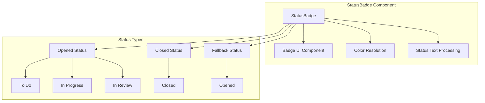
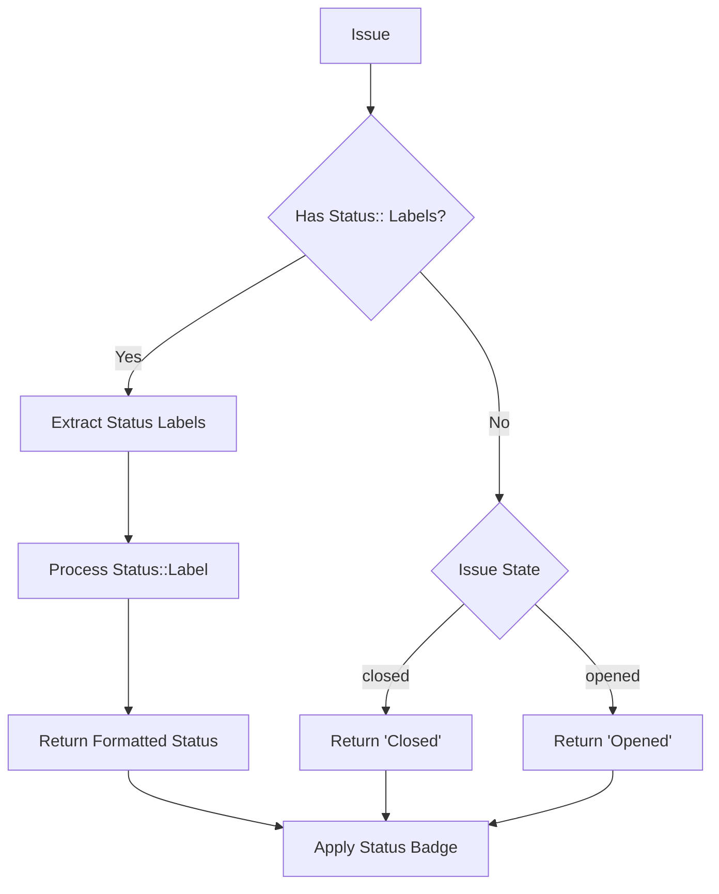
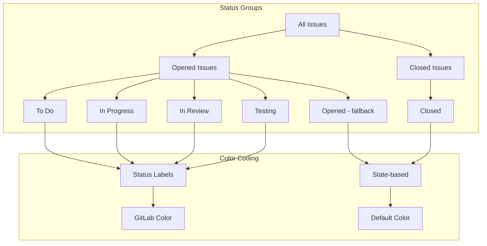

# Issue Status Display Update

## Overview

This design document outlines the enhancement of the issue status display feature in the Navigator application's Issues tab. The current implementation displays issues with simple "opened" and "closed" states. The update will introduce dynamic status resolution based on GitLab workflow labels, creating two main groups: **Opened** (with sub-statuses) and **Closed** (global status), with enhanced visual representation through colored badges.

## Technology Stack & Dependencies

- **React 18** - Component framework
- **TypeScript** - Type definitions
- **Tailwind CSS** - Styling
- **shadcn/ui Badge** - Status badge components
- **GitLab REST API** - Status label data source
- **React Query** - Data fetching and caching

## Component Architecture

### Core Components to Modify

#### StatusBadge Component (New)
A specialized badge component for displaying issue statuses with appropriate colors and styling.

**Props Interface:**
```typescript
interface StatusBadgeProps {
  status: string;
  variant: 'opened' | 'closed' | 'status';
  color?: string;
  className?: string;
}
```

**Component Structure:**


#### Enhanced NewEnhancedIssuesList Component
Update the existing component to use the new status resolution system.

**Key Changes:**
- Replace hardcoded status badges with StatusBadge component
- Integrate status resolution service
- Update grouping logic for enhanced status categories

### Status Resolution Architecture

#### StatusResolutionService Enhancement
Extend the existing service to handle the new status requirements.

**Status Resolution Flow:**


**Status Processing Logic:**
1. **Priority 1**: Extract labels with "Status::" prefix
2. **Priority 2**: Use issue state ("opened" or "closed")
3. **Status Formatting**: Remove "Status::" prefix for display

## Data Models & API Integration

### Enhanced GitLab Issue Type
Update the existing GitLabIssue interface to include resolved status information.

```typescript
interface GitLabIssue {
  // ... existing properties
  labels: string[];
  state: 'opened' | 'closed';
  // Enhanced status fields
  resolved_status?: ResolvedStatus;
}

interface ResolvedStatus {
  name: string;
  source: 'label' | 'state';
  category: 'opened' | 'closed';
  color?: string;
  originalLabel?: string;
}
```

### Label Processing Structure
Structure for processing GitLab label data from the API response.

```typescript
interface GitLabLabel {
  id: string;
  title: string;
  color: string;
  description: string;
}

interface StatusLabelData {
  statusLabels: GitLabLabel[];
  colorMapping: Record<string, string>;
}
```

## Business Logic Layer

### Status Resolution Service

#### Enhanced Status Resolution
```typescript
class StatusResolutionService {
  static resolveIssueStatus(issue: GitLabIssue): ResolvedStatus {
    // 1. Check for Status:: labels
    const statusLabel = this.extractStatusLabel(issue.labels);
    if (statusLabel) {
      return {
        name: this.formatStatusName(statusLabel.title),
        source: 'label',
        category: 'opened',
        color: statusLabel.color,
        originalLabel: statusLabel.title
      };
    }
    
    // 2. Fallback to issue state
    return {
      name: issue.state === 'closed' ? 'Closed' : 'Opened',
      source: 'state',
      category: issue.state === 'closed' ? 'closed' : 'opened'
    };
  }
  
  private static extractStatusLabel(labels: string[]): GitLabLabel | null {
    return labels.find(label => label.startsWith('Status::')) || null;
  }
  
  private static formatStatusName(statusLabel: string): string {
    return statusLabel.replace('Status::', '').trim();
  }
}
```

### Grouping Enhancement

#### Updated Grouping Logic
Modify the existing grouping utilities to handle enhanced status categories.

```typescript
function getGroupName(issue: GitLabIssue, category: GroupingCategory): string {
  switch (category) {
    case 'status':
      const resolvedStatus = StatusResolutionService.resolveIssueStatus(issue);
      return resolvedStatus.name;
    // ... other cases remain the same
  }
}
```

#### Status Group Structure


## API Integration Layer

### Enhanced Data Fetching

#### Labels Integration Hook
```typescript
const useGitLabLabelsWithStatus = (credentials: GitLabCredentials | null) => {
  const { data: labels } = useGitLabProjectLabels(credentials);
  
  const statusLabels = useMemo(() => {
    if (!labels) return [];
    return labels.filter(label => label.title.startsWith('Status::'));
  }, [labels]);
  
  const colorMapping = useMemo(() => {
    const mapping: Record<string, string> = {};
    statusLabels.forEach(label => {
      const statusName = label.title.replace('Status::', '');
      mapping[statusName] = label.color;
    });
    return mapping;
  }, [statusLabels]);
  
  return { statusLabels, colorMapping };
};
```

#### Issues with Enhanced Status Hook
```typescript
const useGitLabIssuesWithEnhancedStatus = (credentials: GitLabCredentials | null) => {
  const { data: issues, ...issuesQuery } = useGitLabIssues(credentials);
  const { colorMapping } = useGitLabLabelsWithStatus(credentials);
  
  const issuesWithStatus = useMemo(() => {
    if (!issues) return [];
    
    return issues.map(issue => ({
      ...issue,
      resolved_status: StatusResolutionService.resolveIssueStatus(issue, colorMapping)
    }));
  }, [issues, colorMapping]);
  
  return {
    data: issuesWithStatus,
    ...issuesQuery
  };
};
```

## Styling Strategy

### Status Badge Styling
```typescript
const StatusBadge = ({ status, variant, color, className }: StatusBadgeProps) => {
  const getVariantStyle = () => {
    switch (variant) {
      case 'status':
        return color ? { 
          backgroundColor: color, 
          color: getContrastColor(color),
          border: `1px solid ${color}`
        } : 'default';
      case 'closed':
        return 'secondary';
      case 'opened':
      default:
        return 'default';
    }
  };
  
  return (
    <Badge 
      variant={typeof getVariantStyle() === 'string' ? getVariantStyle() : undefined}
      style={typeof getVariantStyle() === 'object' ? getVariantStyle() : undefined}
      className={className}
    >
      {status}
    </Badge>
  );
};
```

### Color Utilities
```typescript
// Utility function to determine text color based on background
const getContrastColor = (hexColor: string): string => {
  const r = parseInt(hexColor.slice(1, 3), 16);
  const g = parseInt(hexColor.slice(3, 5), 16);
  const b = parseInt(hexColor.slice(5, 7), 16);
  
  // Calculate relative luminance
  const luminance = (0.299 * r + 0.587 * g + 0.114 * b) / 255;
  
  return luminance > 0.5 ? '#000000' : '#ffffff';
};
```

## State Management

### Status Cache Management
Implement caching for status label data to optimize performance.

```typescript
const statusCache = new Map<string, StatusLabelData>();

const useStatusCache = (groupId: string) => {
  const getCachedStatus = useCallback(() => {
    return statusCache.get(groupId);
  }, [groupId]);
  
  const setCachedStatus = useCallback((data: StatusLabelData) => {
    statusCache.set(groupId, data);
  }, [groupId]);
  
  return { getCachedStatus, setCachedStatus };
};
```

## Testing Strategy

### Unit Tests

#### StatusResolutionService Tests
```typescript
describe('StatusResolutionService', () => {
  describe('resolveIssueStatus', () => {
    it('should extract status from Status:: labels', () => {
      const issue = {
        labels: ['Status::To Do', 'bug'],
        state: 'opened'
      } as GitLabIssue;
      
      const result = StatusResolutionService.resolveIssueStatus(issue);
      expect(result.name).toBe('To Do');
      expect(result.source).toBe('label');
      expect(result.category).toBe('opened');
    });
    
    it('should fallback to issue state when no Status:: labels', () => {
      const issue = {
        labels: ['bug', 'enhancement'],
        state: 'closed'
      } as GitLabIssue;
      
      const result = StatusResolutionService.resolveIssueStatus(issue);
      expect(result.name).toBe('Closed');
      expect(result.source).toBe('state');
      expect(result.category).toBe('closed');
    });
  });
});
```

#### StatusBadge Component Tests
```typescript
describe('StatusBadge', () => {
  it('should render with custom color for status labels', () => {
    render(
      <StatusBadge 
        status="In Progress" 
        variant="status" 
        color="#ff6b6b" 
      />
    );
    
    const badge = screen.getByText('In Progress');
    expect(badge).toHaveStyle({ backgroundColor: '#ff6b6b' });
  });
  
  it('should render with default styling for state-based status', () => {
    render(<StatusBadge status="Opened" variant="opened" />);
    
    const badge = screen.getByText('Opened');
    expect(badge).toHaveClass('badge-default');
  });
});
```

### Integration Tests

#### End-to-End Status Display
```typescript
describe('Enhanced Status Display', () => {
  it('should group issues by enhanced status categories', async () => {
    // Mock GitLab API responses
    const issues = [
      { labels: ['Status::To Do'], state: 'opened', title: 'Issue 1' },
      { labels: ['Status::In Progress'], state: 'opened', title: 'Issue 2' },
      { labels: [], state: 'closed', title: 'Issue 3' },
      { labels: ['bug'], state: 'opened', title: 'Issue 4' }
    ];
    
    render(<NewEnhancedIssuesList issues={issues} isLoading={false} />);
    
    // Select status grouping
    fireEvent.click(screen.getByText('Status'));
    
    // Verify status groups are displayed
    expect(screen.getByText('To Do')).toBeInTheDocument();
    expect(screen.getByText('In Progress')).toBeInTheDocument();
    expect(screen.getByText('Closed')).toBeInTheDocument();
    expect(screen.getByText('Opened')).toBeInTheDocument();
  });
});
```