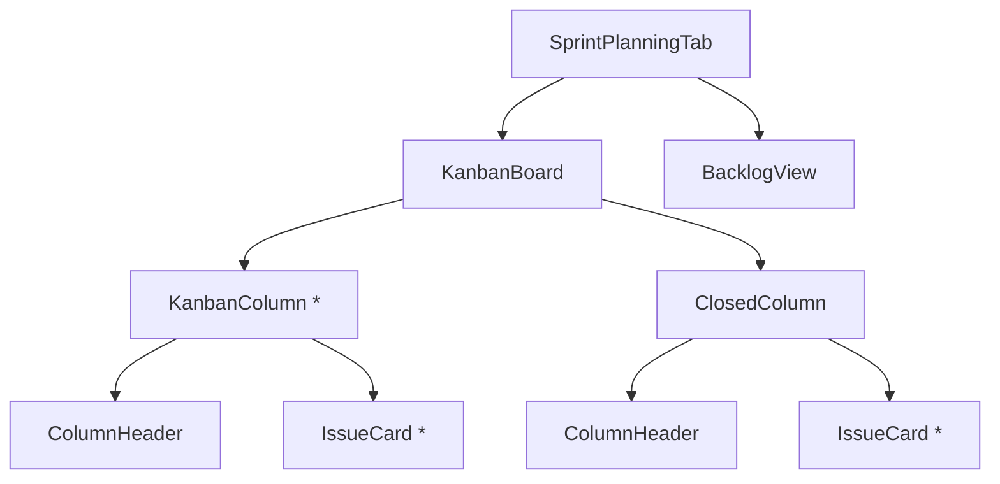

# Kanban Board Restructure Design Document

## 1. Overview

This document outlines the design for restructuring the Kanban board in the Navigator application to meet new requirements:
- Lists will be created based on issue status
- Issues without a defined status will not be displayed on the board
- A dedicated "Closed" list will be shown at the end
- The "Closed" list will only show issues that are both closed AND belong to the current sprint

## 2. Architecture

### 2.1 Current Implementation
The current Kanban board implementation includes:
- Status detection from issue labels using explicit "Status:" prefixes and common keywords
- Board columns defined with predefined statuses and visual properties
- Grouping of issues by status for display
- Separate handling for closed issues

### 2.2 Proposed Restructure
The restructured Kanban board will:
- Filter out issues without a defined status entirely
- Create columns dynamically based on detected statuses
- Always show a "Closed" column at the end for closed sprint issues
- Maintain consistent styling and visual indicators

### 2.3 Component Structure

## 3. Data Models

### 3.1 Issue Status Detection
The status detection logic will be enhanced to ensure only issues with clearly defined statuses are included:
- First check for explicit "Status:" labels
- Normalize "To Do" variations to a standard format
- Check common status labels like "Done", "Review", "In Progress", etc.
- Return null for issues without status (which will be excluded)

### 3.2 Column Definition
Columns will be dynamically generated based on the statuses found in issues with the following properties:
- ID: Status name
- Icon: Visual indicator
- Color: Color class for styling

## 4. Business Logic

### 4.1 Issue Filtering
1. **Status-based filtering**: Only issues with a clearly defined status will be displayed
2. **Closed issue filtering**: Closed issues will only appear in the dedicated "Closed" column if they belong to the current sprint

### 4.2 Column Generation
1. Extract all unique statuses from current sprint issues
2. Create columns dynamically for each status
3. Always add a "Closed" column at the end
4. Only display columns that have issues

### 4.3 Issue Grouping
Issues will be grouped by their status with the following rules:
- Issues without a defined status are excluded entirely
- Each status gets its own column
- Closed issues are grouped separately in the "Closed" column

## 5. UI Components

### 5.1 KanbanColumn Component

**Properties**:
- Title: Column title (status name)
- Icon: Status icon
- Color: Color class for styling
- Issues: Array of issues in this column
- Count: Number of issues in the column

**Features**:
- Visual header with icon, title, and count
- Scrollable area for issue cards
- "No issues" message when column is empty
- Consistent styling with other columns

### 5.2 IssueCard Component

**Properties**:
- Issue: GitLabIssue object
- ViewMode: Display mode ('kanban' | 'list' | 'grid')

**Features**:
- Colored left border matching status color
- Display of iid, title, labels, assignee, and dates
- Filtered labels (status labels hidden in Kanban view)
- Responsive design for different view modes

### 5.3 ClosedColumn Component
Specialized component for the closed issues column:
- Always displayed at the end of the board
- Only shows closed issues from the current sprint
- Uses appropriate "Done" icon and styling

## 6. State Management

### 6.1 Local State
- ActiveView: Controls whether sprint or backlog view is displayed
- Column visibility based on issues present

### 6.2 Data Flow
1. Receive issues from parent component
2. Filter and group issues by status
3. Generate column definitions
4. Render columns with appropriate issues

## 7. Testing

### 7.1 Unit Tests
1. Test status detection logic with various label combinations
2. Verify issue filtering correctly excludes issues without status
3. Confirm closed issues are properly filtered by sprint membership
4. Validate column generation with different status combinations

### 7.2 Integration Tests
1. Test complete rendering of Kanban board with sample data
2. Verify correct positioning of "Closed" column
3. Confirm responsive behavior with different numbers of columns
4. Test edge cases (no issues, all issues closed, etc.)

## 8. Implementation Plan

### 8.1 Phase 1: Core Logic
- Enhance status detection to exclude issues without status
- Implement dynamic column generation
- Add dedicated "Closed" column logic

### 8.2 Phase 2: UI Components
- Update column rendering to be dynamic
- Ensure consistent styling across all columns
- Implement proper issue card filtering

### 8.3 Phase 3: Testing
- Write unit tests for new logic
- Perform integration testing with sample data
- Validate edge cases and error conditions