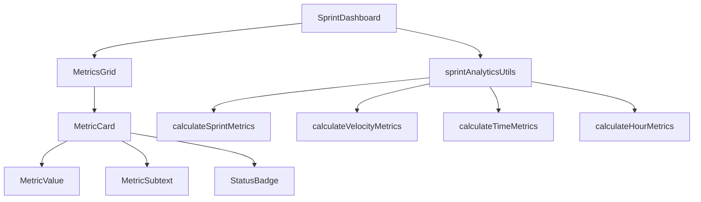
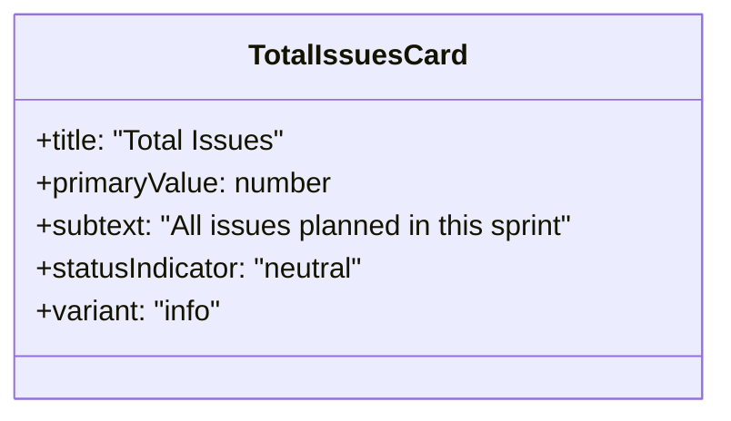
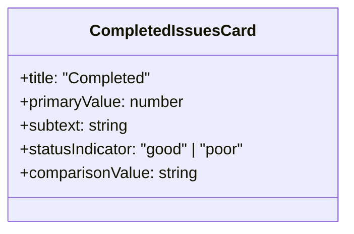
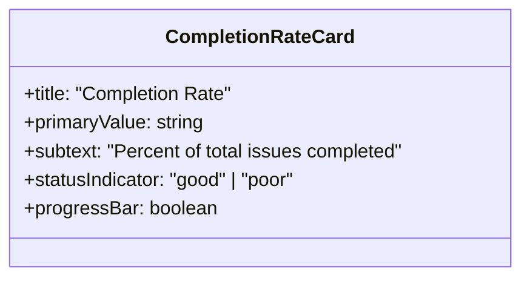
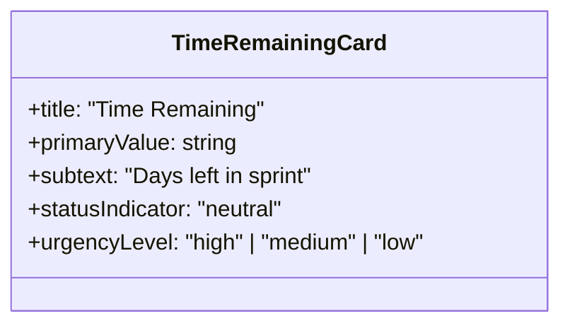
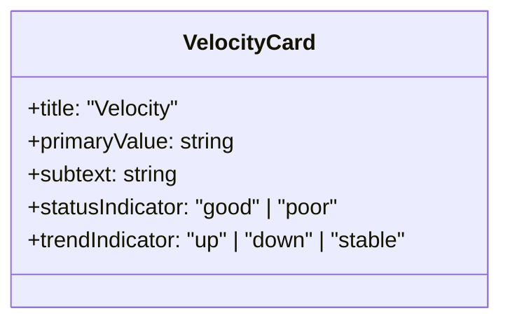
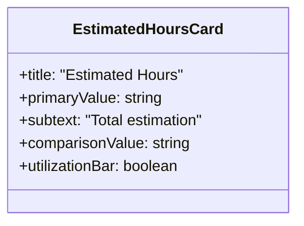
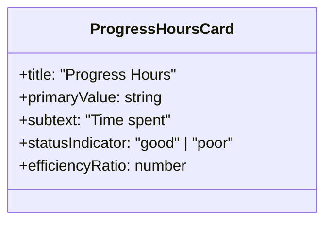

# Sprint Dashboard Metrics Design

## Overview

This document outlines the design for a comprehensive Sprint Dashboard Metrics feature that provides real-time insights into sprint progress, team velocity, and resource utilization. The dashboard will present 7 key metrics cards in a responsive grid layout, offering stakeholders actionable data to monitor sprint health and make informed decisions.

The Sprint Dashboard Metrics extends the existing Navigator application's team performance capabilities by adding sprint-specific analytics with intelligent status indicators, comparative analysis, and time-based calculations.

## Technology Stack & Dependencies

**Frontend Framework:**
- React 18.3.1 with TypeScript 5.8.3
- Vite 5.4.19 for build tooling
- Tailwind CSS 3.4.17 for styling
- shadcn/ui component library

**State Management:**
- React Query 5.85.5 for data fetching and caching
- Custom hooks for GitLab API integration

**Existing Dependencies:**
- `useGitLabAPI` hook for data fetching
- `teamMetricsUtils` library for metric calculations
- GitLab API integration for issue and milestone data

## Component Architecture

### Core Components



### Component Hierarchy

#### SprintDashboard Component
**Purpose:** Main container component that orchestrates data fetching and metric calculations
**Props:**
- `issues: GitLabIssue[]` - All issues for the current sprint
- `currentIteration: string | null` - Active sprint/iteration identifier
- `users: GitLabUser[]` - Team members for capacity calculations
- `isLoading: boolean` - Loading state indicator

#### MetricsGrid Component
**Purpose:** Responsive grid layout container for metric cards
**Features:**
- Adaptive grid layout (2x2 on mobile, 3x3 on tablet, 4x2 on desktop)
- Consistent spacing and alignment
- Responsive breakpoints using Tailwind CSS

#### MetricCard Component
**Purpose:** Individual metric display card with status indicators
**Props:**
```typescript
interface MetricCardProps {
  title: string;
  primaryValue: string | number;
  subtext: string;
  statusIndicator?: 'good' | 'poor' | 'neutral';
  comparisonValue?: string;
  className?: string;
}
```

### Data Models & Metric Interfaces

```typescript
interface SprintMetrics {
  totalIssues: number;
  completedIssues: number;
  completionRate: number;
  timeRemaining: number;
  achievedVelocity: number;
  requiredVelocity: number;
  estimatedHours: number;
  spentHours: number;
  sprintCapacityHours: number;
}

interface VelocityMetrics {
  achievedVelocity: number;
  requiredVelocity: number;
  elapsedDays: number;
  remainingDays: number;
  status: 'good' | 'poor';
}

interface TimeMetrics {
  sprintStartDate: string;
  sprintEndDate: string;
  totalSprintDays: number;
  elapsedDays: number;
  remainingDays: number;
  elapsedPercentage: number;
}

interface HourMetrics {
  totalEstimated: number;
  totalSpent: number;
  sprintCapacity: number;
  utilizationPercentage: number;
  progressPercentage: number;
  efficiency: 'good' | 'poor';
}
```

## Business Logic Layer

### Sprint Analytics Utilities

#### Core Calculation Functions

**calculateSprintMetrics(issues, currentIteration, users)**
- Aggregates all sprint-related metrics
- Filters issues by current iteration
- Integrates velocity, time, and hour calculations
- Returns comprehensive SprintMetrics object

**calculateVelocityMetrics(issues, timeMetrics)**
```typescript
function calculateVelocityMetrics(
  issues: GitLabIssue[], 
  timeMetrics: TimeMetrics
): VelocityMetrics {
  const completedIssues = issues.filter(i => i.state === 'closed').length;
  const totalIssues = issues.length;
  const remainingIssues = totalIssues - completedIssues;
  
  const achievedVelocity = timeMetrics.elapsedDays > 0 
    ? completedIssues / timeMetrics.elapsedDays 
    : 0;
    
  const requiredVelocity = timeMetrics.remainingDays > 0 
    ? remainingIssues / timeMetrics.remainingDays 
    : 0;
    
  return {
    achievedVelocity,
    requiredVelocity,
    elapsedDays: timeMetrics.elapsedDays,
    remainingDays: timeMetrics.remainingDays,
    status: achievedVelocity >= requiredVelocity ? 'good' : 'poor'
  };
}
```

**calculateTimeMetrics(currentIteration)**
```typescript
function calculateTimeMetrics(currentIteration: GitLabMilestone): TimeMetrics {
  const now = new Date();
  const startDate = new Date(currentIteration.start_date || now);
  const endDate = new Date(currentIteration.due_date || addDays(now, 14));
  
  const totalSprintDays = differenceInDays(endDate, startDate);
  const elapsedDays = Math.max(0, differenceInDays(now, startDate));
  const remainingDays = Math.max(0, differenceInDays(endDate, now));
  
  return {
    sprintStartDate: startDate.toISOString(),
    sprintEndDate: endDate.toISOString(),
    totalSprintDays,
    elapsedDays,
    remainingDays,
    elapsedPercentage: totalSprintDays > 0 ? (elapsedDays / totalSprintDays) * 100 : 0
  };
}
```

**calculateHourMetrics(issues, users, sprintDuration)**
```typescript
function calculateHourMetrics(
  issues: GitLabIssue[], 
  users: GitLabUser[], 
  sprintDuration: number
): HourMetrics {
  const totalEstimated = issues.reduce((sum, issue) => 
    sum + (issue.time_stats?.time_estimate || 0), 0) / 3600; // Convert to hours
    
  const totalSpent = issues.reduce((sum, issue) => 
    sum + (issue.time_stats?.total_time_spent || 0), 0) / 3600;
    
  const sprintCapacity = sprintDuration * 8 * users.length; // 8 hours per day per user
  
  const utilizationPercentage = sprintCapacity > 0 
    ? (totalEstimated / sprintCapacity) * 100 
    : 0;
    
  const progressPercentage = totalEstimated > 0 
    ? (totalSpent / totalEstimated) * 100 
    : 0;
    
  const completionPercentage = issues.filter(i => i.state === 'closed').length / issues.length * 100;
  
  return {
    totalEstimated,
    totalSpent,
    sprintCapacity,
    utilizationPercentage,
    progressPercentage,
    efficiency: Math.abs(progressPercentage - completionPercentage) <= 10 ? 'good' : 'poor'
  };
}
```

### Status Indicator Logic

**Completion Rate Status:**
```typescript
function getCompletionStatus(completionRate: number, elapsedPercentage: number): 'good' | 'poor' {
  return completionRate >= elapsedPercentage ? 'good' : 'poor';
}
```

**Velocity Status:**
```typescript
function getVelocityStatus(achieved: number, required: number): 'good' | 'poor' {
  return achieved >= required ? 'good' : 'poor';
}
```

**Hour Efficiency Status:**
```typescript
function getHourEfficiencyStatus(spentPercentage: number, completionPercentage: number): 'good' | 'poor' {
  const efficiency = Math.abs(spentPercentage - completionPercentage);
  return efficiency <= 15 ? 'good' : 'poor'; // 15% tolerance
}
```

## API Integration Layer

### Data Fetching Patterns

**Enhanced GitLab API Integration:**
```typescript
// Extend existing useGitLabAPI hook
const useSprintData = (iterationTitle: string) => {
  const { data: issues } = useFetchIssues({
    iteration: iterationTitle,
    with_labels_details: true,
    scope: 'all'
  });
  
  const { data: users } = useFetchProjectMembers();
  
  const { data: milestones } = useFetchMilestones({
    title: iterationTitle,
    state: 'active'
  });
  
  return { issues, users, milestones };
};
```

### GitLab Data Models Enhancement

**Extended GitLabIssue Interface:**
```typescript
interface GitLabIssue {
  // ... existing fields
  time_stats: {
    time_estimate: number; // in seconds
    total_time_spent: number; // in seconds
  };
  iteration: {
    title: string;
    start_date?: string;
    due_date?: string;
    id: number;
    state: 'opened' | 'upcoming' | 'started' | 'closed';
  };
}
```

## Metric Cards Specification

### 1. Total Issues Card

- **Data Source:** `issues.length`
- **Display Format:** Large number (e.g., "97")
- **Color Scheme:** Blue/neutral background

### 2. Completed Issues Card

- **Data Source:** `issues.filter(i => i.state === 'closed').length`
- **Display Format:** "6 of 97"
- **Status Logic:** Compare completion % vs elapsed sprint %
- **Colors:** Green (good) / Red (poor)

### 3. Completion Rate Card

- **Data Source:** `(completedIssues / totalIssues) * 100`
- **Display Format:** "6%" with progress bar
- **Status Logic:** Good if ≥ elapsed sprint percentage

### 4. Time Remaining Card

- **Data Source:** Days between now and sprint end date
- **Display Format:** "10 days"
- **Visual Indicator:** Warning color if ≤ 3 days

### 5. Velocity Card

- **Primary Value:** Achieved velocity (issues/day)
- **Subtext:** Required velocity for remaining work
- **Status Logic:** Good if achieved ≥ required
- **Display Format:** "1.5 issues/day" / "Need 9.1 issues/day"

### 6. Estimated Hours Card

- **Data Source:** Sum of all issue time estimates
- **Display Format:** "617h"
- **Comparison:** Sprint capacity utilization percentage
- **Visual:** Utilization bar showing capacity vs estimates

### 7. Progress Hours Card

- **Data Source:** Sum of logged time on all issues
- **Display Format:** "63h"
- **Status Logic:** Good if spent % ≈ completion %
- **Efficiency Indicator:** Visual comparison of time vs progress

## Styling Strategy

### Card Layout System
```css
.metrics-grid {
  @apply grid gap-6 p-6;
  @apply grid-cols-1 md:grid-cols-2 lg:grid-cols-3 xl:grid-cols-4;
}

.metric-card {
  @apply bg-white dark:bg-gray-800 rounded-lg border shadow-sm;
  @apply p-6 space-y-4 transition-all duration-200;
  @apply hover:shadow-md hover:scale-105;
}

.metric-card.good {
  @apply border-green-200 bg-green-50 dark:bg-green-900/20;
}

.metric-card.poor {
  @apply border-red-200 bg-red-50 dark:bg-red-900/20;
}

.metric-card.neutral {
  @apply border-blue-200 bg-blue-50 dark:bg-blue-900/20;
}
```

### Status Badge Styling
```css
.status-badge.good {
  @apply bg-green-100 text-green-800 border-green-200;
}

.status-badge.poor {
  @apply bg-red-100 text-red-800 border-red-200;
}

.status-badge.neutral {
  @apply bg-gray-100 text-gray-800 border-gray-200;
}
```

### Responsive Design Implementation
```css
/* Mobile-first responsive design */
@media (max-width: 768px) {
  .metrics-grid {
    @apply grid-cols-1 gap-4 p-4;
  }
  
  .metric-card {
    @apply p-4;
  }
  
  .primary-value {
    @apply text-2xl;
  }
}

@media (min-width: 769px) and (max-width: 1024px) {
  .metrics-grid {
    @apply grid-cols-2;
  }
}

@media (min-width: 1025px) {
  .metrics-grid {
    @apply grid-cols-4;
  }
}
```

## Testing Strategy

### Unit Testing

**Utility Function Tests:**
```typescript
describe('sprintAnalyticsUtils', () => {
  describe('calculateVelocityMetrics', () => {
    it('should calculate achieved velocity correctly', () => {
      const issues = mockIssuesWithStates(['closed', 'closed', 'opened']);
      const timeMetrics = { elapsedDays: 2, remainingDays: 8 };
      
      const result = calculateVelocityMetrics(issues, timeMetrics);
      
      expect(result.achievedVelocity).toBe(1); // 2 completed / 2 days
      expect(result.requiredVelocity).toBe(0.125); // 1 remaining / 8 days
    });
  });
  
  describe('calculateTimeMetrics', () => {
    it('should handle sprint with no dates', () => {
      const milestone = { title: 'Sprint 1' };
      
      const result = calculateTimeMetrics(milestone);
      
      expect(result.remainingDays).toBeGreaterThan(0);
      expect(result.totalSprintDays).toBe(14); // Default 2-week sprint
    });
  });
});
```

**Component Tests:**
```typescript
describe('MetricCard', () => {
  it('should render with good status styling', () => {
    render(
      <MetricCard
        title="Test Metric"
        primaryValue="100"
        subtext="Test subtext"
        statusIndicator="good"
      />
    );
    
    expect(screen.getByText('Test Metric')).toBeInTheDocument();
    expect(screen.getByText('100')).toBeInTheDocument();
    expect(screen.getByRole('card')).toHaveClass('good');
  });
});
```

### Integration Testing

**Sprint Dashboard Integration:**
```typescript
describe('SprintDashboard Integration', () => {
  it('should display all 7 metric cards with correct data', async () => {
    const mockData = {
      issues: mockSprintIssues,
      users: mockUsers,
      currentIteration: 'Sprint 1'
    };
    
    render(<SprintDashboard {...mockData} />);
    
    // Verify all cards are rendered
    expect(screen.getByText('Total Issues')).toBeInTheDocument();
    expect(screen.getByText('Completed')).toBeInTheDocument();
    expect(screen.getByText('Completion Rate')).toBeInTheDocument();
    expect(screen.getByText('Time Remaining')).toBeInTheDocument();
    expect(screen.getByText('Velocity')).toBeInTheDocument();
    expect(screen.getByText('Estimated Hours')).toBeInTheDocument();
    expect(screen.getByText('Progress Hours')).toBeInTheDocument();
    
    // Verify status indicators
    await waitFor(() => {
      expect(screen.getByTestId('completion-status')).toHaveClass('good');
    });
  });
});
```