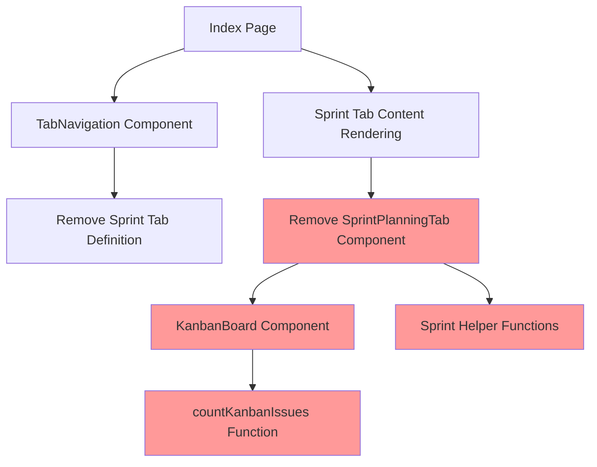
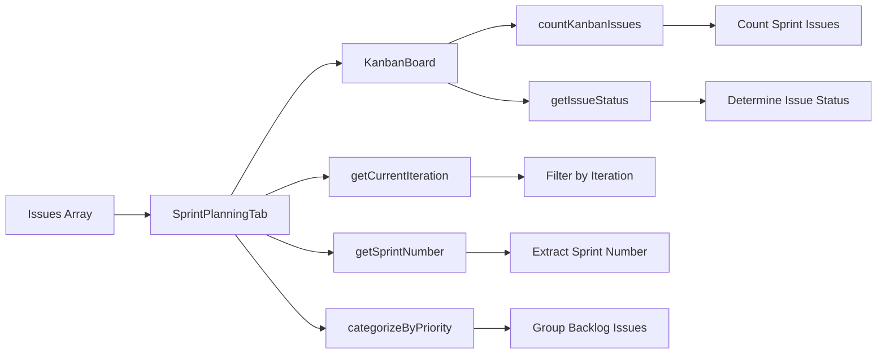
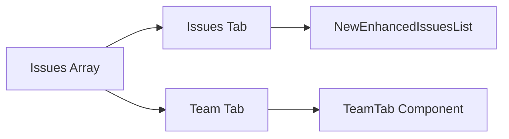

# Sprint Planning Tab Removal Design

## Overview

This design document outlines the removal of the Sprint Planning tab and all its dependent features from the GitLab Navigator application. The Sprint Planning functionality includes the kanban board view, backlog management, iteration-based issue filtering, and sprint-specific UI components.

## Architecture

The Sprint Planning removal involves modifications across multiple layers of the application:



## Component Dependencies

### Primary Components to Remove
- `SprintPlanningTab.tsx` - Main sprint planning component
- Sprint-specific rendering logic in `Index.tsx`

### Secondary Components to Evaluate
- `KanbanBoard.tsx` - Kanban board component (used only by Sprint Planning)
- Sprint-related functions and helpers

### Components to Modify
- `TabNavigation.tsx` - Remove sprint tab definition
- `Index.tsx` - Remove sprint tab rendering logic

## Data Flow Analysis

### Current Sprint Planning Data Flow



### After Removal Data Flow



## Component Removal Strategy

### 1. TabNavigation Component Updates

**Current Tab Definition:**
```typescript
const tabs = [
  { id: 'issues' as const, label: 'Issues', icon: List },
  { id: 'sprint' as const, label: 'Sprint Planning', icon: Calendar },
  { id: 'team' as const, label: 'Team', icon: Users },
];

export type TabType = 'issues' | 'team' | 'sprint';
```

**Updated Tab Definition:**
```typescript
const tabs = [
  { id: 'issues' as const, label: 'Issues', icon: List },
  { id: 'team' as const, label: 'Team', icon: Users },
];

export type TabType = 'issues' | 'team';
```

### 2. Index.tsx Component Updates

**Removal of Sprint Import:**
- Remove `SprintPlanningTab` import
- Remove sprint case from `renderTabContent()`

**Tab Rendering Logic:**
```typescript
// BEFORE - Three tab system
const renderTabContent = () => {
  switch (activeTab) {
    case 'issues':
      return <NewEnhancedIssuesList issues={issuesToShow} isLoading={issuesLoading} />;
    case 'sprint':
      return <SprintPlanningTab 
        issues={issuesToShow} 
        users={users} 
        isLoading={issuesLoading || usersLoading} 
      />;
    case 'team':
      return <TeamTab 
        issues={issuesToShow} 
        users={users} 
        isLoading={issuesLoading || usersLoading} 
        selectedAssignees={selectedAssignees}
      />;
    default:
      return null;
  }
};

// AFTER - Two tab system
const renderTabContent = () => {
  switch (activeTab) {
    case 'issues':
      return <NewEnhancedIssuesList issues={issuesToShow} isLoading={issuesLoading} />;
    case 'team':
      return <TeamTab 
        issues={issuesToShow} 
        users={users} 
        isLoading={issuesLoading || usersLoading} 
        selectedAssignees={selectedAssignees}
      />;
    default:
      return null;
  }
};
```

### 3. File Removal Strategy

**Files to Delete:**
- `src/components/SprintPlanningTab.tsx`
- `src/components/KanbanBoard.tsx` (if only used by Sprint Planning)

**Verification Steps:**
1. Search codebase for `KanbanBoard` imports
2. Confirm no other components depend on kanban functionality
3. Remove associated helper functions if unused elsewhere

## UI/UX Impact Analysis

### Navigation Changes

**Before:**
| Issues | Sprint Planning | Team |
|--------|----------------|------|

**After:**
| Issues | Team |
|--------|------|

### Feature Loss Assessment

**Removed Capabilities:**
- Sprint/Iteration-based issue viewing
- Kanban board visualization
- Backlog prioritization interface
- Sprint progress tracking
- Iteration-based issue counts

**Retained Capabilities:**
- Complete issue listing and filtering
- Team performance metrics
- Project analytics
- User assignment tracking

## Migration Considerations

### User Workflow Changes

**Previous Sprint Planning Workflow:**
1. Navigate to Sprint Planning tab
2. Switch between Sprint and Backlog views
3. View issues in kanban columns by status
4. Manage backlog priorities

**New Workflow:**
1. Use Issues tab for all issue management
2. Use Team tab for performance insights
3. Rely on GitLab native interface for sprint planning

### Data Preservation

**No Data Loss:**
- All issue data remains accessible via Issues tab
- Team metrics and analytics preserved
- Filter functionality maintains full capability

## Implementation Steps

### Phase 1: Component Removal
1. Remove `SprintPlanningTab` component file
2. Remove `KanbanBoard` component file (if unused elsewhere)
3. Update imports in affected files

### Phase 2: Navigation Updates
1. Modify `TabNavigation.tsx`
   - Remove sprint tab definition
   - Update `TabType` interface
2. Update `Index.tsx`
   - Remove sprint import
   - Remove sprint case from render logic
   - Handle default tab selection

### Phase 3: Type System Updates
1. Update `TabType` type definition
2. Remove sprint-related interfaces if unused
3. Clean up any sprint-specific type imports

### Phase 4: Testing Strategy

**Component Testing:**
- Verify tab navigation works with two tabs
- Confirm Issues and Team tabs function correctly
- Test that removed components don't cause runtime errors

**Integration Testing:**
- Verify application loads without sprint functionality
- Test tab switching between Issues and Team
- Confirm no broken imports or references

## Code Impact Assessment

### Files Modified
- `src/components/TabNavigation.tsx`
- `src/pages/Index.tsx`

### Files Removed
- `src/components/SprintPlanningTab.tsx`
- `src/components/KanbanBoard.tsx`

### Import Dependencies Affected
```typescript
// Removed imports
import { SprintPlanningTab } from '@/components/SprintPlanningTab';
import { KanbanBoard, countKanbanIssues } from '@/components/KanbanBoard';
```

## Risk Mitigation

### Potential Issues
1. **Broken References:** Ensure no other components import removed files
2. **Type Errors:** Update all TabType references
3. **Default Tab Logic:** Handle cases where 'sprint' was default active tab

### Mitigation Strategies
1. **Comprehensive Search:** Use IDE/editor to find all references to removed components
2. **Gradual Removal:** Remove components first, then update navigation
3. **Testing:** Verify each step before proceeding to next phase

## Validation Criteria

### Success Metrics
- ✅ Application loads without errors
- ✅ Navigation shows only Issues and Team tabs
- ✅ Tab switching works correctly
- ✅ No broken imports or component references
- ✅ All existing functionality in Issues and Team tabs preserved

### Failure Indicators
- ❌ Runtime errors related to missing components
- ❌ TypeScript compilation errors
- ❌ Broken tab navigation
- ❌ Missing functionality in remaining tabs